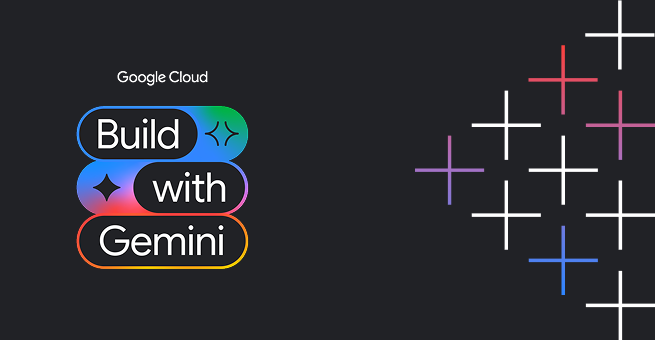

<div align="center">



# 📋 PRD Facilitator Agent

### Agente conversacional inteligente para condução de sessões de elicitação e geração de PRDs orientados a dados de negócio.

[](https://github.com/mportela/buildwithgemini-prd-agent)
[](https://cloud.google.com/vertex-ai)
[](https://google.github.io/adk-docs/)
[](https://cloud.google.com/vertex-ai/generative-ai/docs/multimodal-models)

<br/>


<br/>

</div>

---

## 💡 Sobre o Projeto

O **PRD Facilitator Agent** é um assistente conversacional desenhado para apoiar Product Managers, Tech Leads e times de desenvolvimento na condução estruturada de sessões de descoberta e elicitação de requisitos. 

Ele elimina a ambiguidade em especificações de produto ao:
1. **Cobrir todos os "Porquês" de negócio:** Conduz o time a explicitar dores reais do usuário, proposta de valor e impacto comercial antes de qualquer decisão técnica.
2. **Definir métricas de sucesso quantificáveis:** Exige KPIs claros de negócio e métricas de produto mensuráveis.
3. **Desacoplar requisitos de implementação:** Mantém o PRD focado no *o que* e no *por que*, deixando o *como técnico* a cargo do time de engenharia.
4. **Gerenciar *Open Questions* com rigor:** Mapeia dependências e incertezas abertas para que nenhum PRD avance com premissas não validadas.
5. **Persistir artefatos prontos:** Gera e armazena documentos padronizados em Markdown com critérios de aceitação no formato *Given/When/Then*.

---

## ✨ Principais Recursos

- 🎯 **Elicitação Interativa e Progressiva:** Faz perguntas direcionadas e contextuais ao usuário sem sobrecarregá-lo com questionários extensos.
- ❓ **Rastreamento Estrito de Questões em Aberto:** Identifica e acompanha pontos pendentes de definição de negócio, dependências externas e restrições.
- 💾 **Gestão e Catálogo de PRDs:** Ferramentas nativas de persistência (`save_prd`, `list_prds`, `read_prd`) para manter um repositório centralizado de artefatos de produto.
- 📐 **Critérios de Aceitação Formalizados:** Estruturação de regras de negócio em formato BDD (*Given/When/Then*) pronto para testes de aceitação.
- 🔗 **Extensibilidade Corporativa:** Arquitetura pronta para integração com Jira e Confluence via ferramentas MCP (Model Context Protocol).

---

## ☁️ Ferramentas e Serviços Google Cloud

O agente foi construído seguindo as melhores práticas do ecossistema **Google Cloud Agent Platform** e **ADK (Agent Development Kit)**:

| Ferramenta / Serviço | Papel na Arquitetura |
|---|---|
| 🧠 **Agent Platform Memory Bank** | Memória contextual de longo prazo entre sessões, lembrando contexto de negócio da empresa, convenções da stack e decisões tomadas em PRDs anteriores. |
| 🗄️ **Cloud Firestore** | Armazenamento estruturado de metadados de catálogo de PRDs, controle de versão, status de aprovação e tracking de *open questions*. |
| 🖼️ **Cloud Storage (GCS)** | Repositório central de artefatos de documentação exportados e ativos visuais gerados. |
| 📖 **Vertex AI RAG Engine** | Grounding semântico sobre a base de conhecimento interno (diretrizes de design, PRDs históricos, manuais de compliance e arquitetura). |
| 🎨 **Geração de Imagens (`gemini-3.1-flash-lite-image`)** | Criação sob demanda de mockups visuais conceituais de telas e fluxos de usuário para ilustrar os requisitos do PRD. |
| 🪟 **A2UI (Agent-to-User Interface)** | Renderização de cards executivos, tabelas de status de requisitos e painéis interativos na interface de chat. |
| 🚀 **Vertex AI Agent Runtime (Reasoning Engine)** | Hospedagem gerenciada na nuvem com escalabilidade automática e suporte ao protocolo **A2A (Agent-to-Agent)**. |

---

## 🛠️ Como Executar Localmente

### Pré-requisitos

- Python 3.10+
- `uv` instalado (`curl -LsSf https://astral.sh/uv/install.sh | sh`)
- `google-agents-cli` instalado (`uv tool install google-agents-cli`)
- Autenticação configurada com Google Cloud:
  ```bash
  gcloud auth login
  gcloud auth application-default login
  ```

### 1. Clonar e Instalar

```bash
git clone https://github.com/mportela/buildwithgemini-prd-agent.git
cd buildwithgemini-prd-agent
uv sync
```

### 2. Testar via Linha de Comando

```bash
agents-cli run "Quais PRDs temos documentados atualmente?"
```

```bash
agents-cli run "Crie um PRD para uma funcionalidade de recuperação de carrinho abandonado com notificações push inteligentes"
```

### 3. Executar a Interface Web do Frontend (Chat UI Redesenhada + A2UI)

O projeto conta com um frontend web moderno em FastAPI com layout de diálogo customizado, tema Indigo/Violet, avatares, chips de prompts rápidos, renderização de markdown e suporte nativo a cards A2UI:

```bash
cd frontend
export AGENT_ENGINE_RESOURCE_NAME="projects/385351064219/locations/us-east1/reasoningEngines/1802523969413185536"
export AGENT_DIRECTORY="app"
python main.py
```

Acesse no navegador: `http://localhost:8080` (Conectado diretamente ao agente no Vertex AI Agent Runtime via protocolo A2A)

Para rodar o Playground de desenvolvimento do ADK:
```bash
agents-cli playground --port 8000
```

---

## 🧪 Testes e Avaliação

Execute a suíte de testes unitários e de integração:

```bash
uv run pytest tests/unit tests/integration
```

Para rodar a avaliação contínua com métricas de qualidade:

```bash
agents-cli eval run
```

---

## 🚀 Implantação no Google Cloud (Agent Platform)

O agente está preparado para deploy no **Vertex AI Agent Runtime**:

```bash
agents-cli deploy
```

Consulte o status ou acesse o endpoint remoto implantado:

```bash
agents-cli run \
  --url https://us-east1-aiplatform.googleapis.com/reasoningEngines/v1/projects/385351064219/locations/us-east1/reasoningEngines/1802523969413185536/api \
  --mode a2a \
  "Olá, liste os PRDs disponíveis"
```

---

## 📄 Licença

Este projeto foi desenvolvido como parte do workshop **Build with Gemini World Tour - Track 3**.
